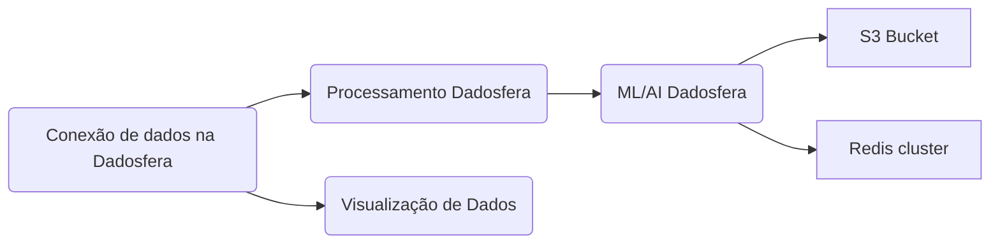

# Case Técnico Dadosfera

## Item 1 - Sobre Storytelling e Apresentação
Vídeo: https://youtu.be/nJOxikAT19c
### Problema Principal a Ser Resolvido:

Atualmente, no método adotado por vocês, enfrentam-se alguns desafios. A arquitetura centrada nos produtos da AWS pode tornar complexa a implementação de modelos de IA para melhorar a experiência de compra dos clientes, exigindo uma equipe considerável para configurar e manter todo o fluxo de dados em pleno funcionamento. Em contraste, a utilização da Dadosfera simplifica significativamente esse processo, demandando uma equipe substancialmente menor.

### Diagrama da Solução com Dadosfera:

Neste diagrama, apresentamos como a Dadosfera pode substituir ou complementar elementos da sua arquitetura atual, proporcionando uma jornada de dados mais integrada e eficiente.



| Processo | Descrição |
|--------|------------|
| Coleta de Dados | Com a capacidade de coleta de dados da Dadosfera, podemos inserir os dados no sistema, que simplifica a manipulação e visualização de dados dentro da plataforma. |
| Processamento e ML | A Dadosfera unifica o processamento, eliminando a necessidade de implementar soluções desnecessariamente complexas, proporcionando uma abordagem mais integrada e simplificada. |
| Visualização de Dados | Na Dadosfera, temos módulos de visualização de dados, que mesmo não sendo o foco do projeto, também podem ser valiosos aliados ao crescimento da empresa. |

### Por que Dadosfera é uma Solução Tecnicamente Mais Viável:

| Motivo | Descrição |
|-------|--------|
| Unificação de Plataforma | Ao consolidar etapas de coleta, processamento, exploração e análise, a Dadosfera elimina a necessidade de múltiplos serviços, simplificando a arquitetura e reduzindo custos operacionais. |
| Suporte Personalizado | Os planos de suporte da Dadosfera garantem um suporte personalizado e humanizado, fundamental para o ambiente crítico de um negócio de e-commerce. |
| Governança de Dados | A Dadosfera enfatiza a governança de dados, proporcionando acesso controlado e garantindo a confidencialidade de cada ativo de dados, promovendo a democratização dos dados de forma segura. |
| Democratização dos Dados | Permitir que todos os funcionários, não apenas equipes de dados ou TI, acessem a Dadosfera, pode proporcionar insights valiosos para impulsionar a inovação em toda a organização. |
| Privacidade e Segurança | A Dadosfera coloca a privacidade e segurança como pilares centrais, alinhando-se à democratização dos dados e fornecendo acesso seguro a todos os membros da equipe. |


Conclusão:

Em resumo, a Dadosfera oferece uma abordagem integrada e eficiente para seu projeto, eliminando desafios atuais e proporcionando oportunidades significativas de crescimento. Agradeço o seu tempo e espero te ver na Dadosfera!


## Item 2 - Sobre a Dadosfera
Para fazer a etapa de carregamento de dados na Dadosfera, primeiro devemos analizar o quão constantemente os dados serão atualizados. 
Se vamos trabalhar com dados estáticos, já extraídos e transformados, que não vão se atualizar constantemente, a melhor opção é fazer um carregamento único de dados através da aba "Importar arquivos".

A imagem abaixo ilustra um arquivo parquet carregado na Dadosfera:


[Link](https://app.dadosfera.ai/pt-BR/collect/import-files/a46bd1ba-de7f-4317-89f5-d43fbfd60431)

Em outros momentos, podemos precisar de atualizar nossos dados de tempo em tempo, pra esses casos, é mais recomendável conectá-los via API nas abas "Conexões" e "Pipelines".
Dessa forma, conseguimos definir de quanto em quanto tempo a Dadosfera deve carregar novamente os dados.

A imagem abaixo ilustra um arquivo carregado através de API:


[Link](https://app.dadosfera.ai/pt-BR/collect/pipelines/d0a3a26c-fad5-4ceb-9660-8718126eece5)

## Item 3 - Sobre GenAI e LLMs
Nesta etapa, usei a nova função "Assistentes" da OpenAI.
O primeiro passo foi utilizar Python pra limpar, transformar os dados e extrair somente as 150 primeiras linhas, já que carregar centenas de milhares de arquivos não era algo financeiramente viável.

Criei um assistente e o configurei com as seguintes opções:


[Link](https://platform.openai.com/assistants)

Após criado, carreguei os dados em um arquivo csv e o pedi para ler e categorizar cada um dos items e me enviar uma lista com o resultado.
Com a lista de categorias criada, eu a adicionei ao dataframe e carreguei de volta à [Dadosfera](https://app.dadosfera.ai/pt-BR/catalog/data-assets/1349292c-6416-4682-8862-9be425a06736)

## Item 4 - Sobre SQL e Python
Para esta etapa, eu criei um dashboard e duas visualizações gráficas diferentes, que podem ser acessados [nesta coleção](https://metabase-treinamentos.dadosfera.ai/collection/330-gabriel-chaves-01-2024)

A primeira visualização utilizou a seguinte query:

```SQL
SELECT PUBLIC.TB__WTI7DQ__PRODUCTSCATEGORY.CATEGORY, COUNT(*) as count
FROM "DADOSFERA_PRD_TREINAMENTOS"."PUBLIC"."TB__WTI7DQ__PRODUCTSCATEGORY"
GROUP BY PUBLIC.TB__WTI7DQ__PRODUCTSCATEGORY.CATEGORY
order by count desc
LIMIT 1048575
```
E esse foi o resultado:


A segunda vizualização utilizou a seguinte query:

```SQL
SELECT TOP 5 CATEGORY,COUNT FROM 
(SELECT PUBLIC.TB__WTI7DQ__PRODUCTSCATEGORY.CATEGORY, COUNT(*) as count
FROM "DADOSFERA_PRD_TREINAMENTOS"."PUBLIC"."TB__WTI7DQ__PRODUCTSCATEGORY"
GROUP BY PUBLIC.TB__WTI7DQ__PRODUCTSCATEGORY.CATEGORY
order by count desc
LIMIT 1048575)
```
E esse foi o resultado:


## Item 5 - Sobre Data Apps
Não consegui ter acesso ao módulo de inteligência, por isso o item bônus abaixo foi feito com outro método.

## Item Bonus 
Nesse desafio, como não consegui o acesso aos Data Apps, resolvi fazer um approach diferente, criei o código abaixo para ler o título dos produtos do dataframe e gerar imagens para cada um deles (vale destacar que isso é somente parte do que foi necessário pra concluir essa etapa).


``` Python
dfFinal['result'] = None 
backupImages = []
for index, row in dfFinal.iterrows():
    if (index % 5 == 0) and (index != 0):
        print('Sleeping for 60 seconds')
        time.sleep(60)
    try:
        response = client.images.generate(
        model="dall-e-2",
        prompt=("Generate the image of the following product: " + str(dfFinal['title'].iloc[index])),
        size="256x256",
        quality="standard",
        n=1,)
        result = response.data[0].url
        response2 = requests.get(result)
        image = Image.open(BytesIO(response2.content))
        image.save('C:/DallE/img'+str(index)+'.png')
    except Exception as e:
        error_message = f"Error: {str(e)}"
        print(error_message + " in index " +str(index))
        result = 'Null'
    backupImages.append(result)
    dfFinal.at[index, 'result'] = result
```

Vários foram os desafios que encontrei durante essa etapa, mas o maior gargalo foi de fato a plataforma da OpenAI, que me impedia de gerar mais de 5 imagens por minuto (isso fez o código levar no mínimo 30 minutos pra poder gerar todas as imagens).

As imagens geradas podem ser encontradas na pasta DallE deste repositório, pra finalizar, vou colocar aqui algumas que achei interessante:

### Produto 146 - Decalare Inflatable Alien Costume For Adults,Alien Funny Blow Up Costumes,Inflatable Halloween Costumes For Men/Women 


### Produto 117 - Bogs Uni-Child Skipper Waterproof  Rain Boot for Boys and Girls 


### Produto 76 - '360 Swivel Wheel Replacement Luggage Travel Suitcase Wheels Plastic, Suitcase Wheel Repair Replace Luggage Wheels, 3.5x2.75x2.2In'


